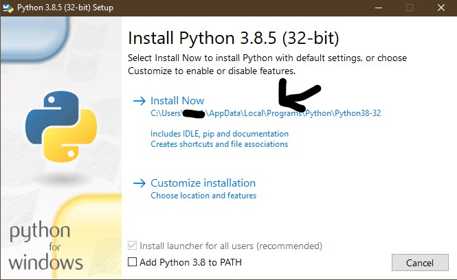
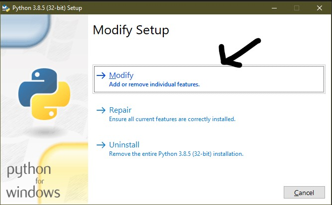
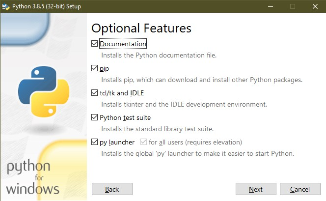
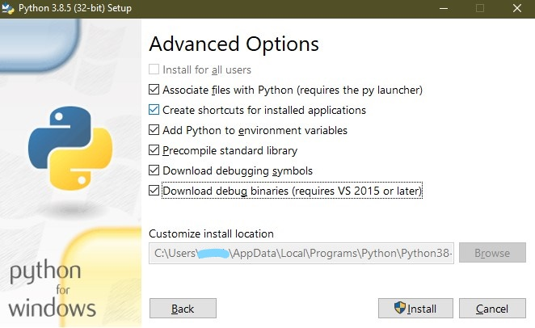

# Installing Python
While this is quite a simple task to do i will help step you through it to make sure that you select the right options to prevent future issues. you can download Python from [The official Website](https://www.python.org/downloads/) (go to this link if you are not on windows), or you can click this link to install [3.9.5 (64bit)](https://www.python.org/ftp/python/3.9.5/python-3.9.5-amd64.exe) for windows (Will download automatically).

Once you find the .exe file in your downloads folder or where you saved it. Open it. you will then see a similar app to this 

Make sure that you have add to PATH box ticked (I took this screenshot before i ticked it) as that will make life alot easier later on when it comes to adding modules. Now click Install and let it do its thing.

Now that python is installed we can continue, But if you want python to work better, re open the installer and click Modify .

Then select all of the optional features and select next.

Than select all the boxes again in Advanced features window. 

**IMPORTANT EDIT: Do not tick the last box as it will install VS 2017. and we don't want that as it is annoying to remove and takes up random space**

This may seem unnessacary but it will help later. Click install and you should be done.

Next to read: [Installing VSC](3-Installing-VSC.md), News and updates about this tutorial: [The Readme file](../README.md)
